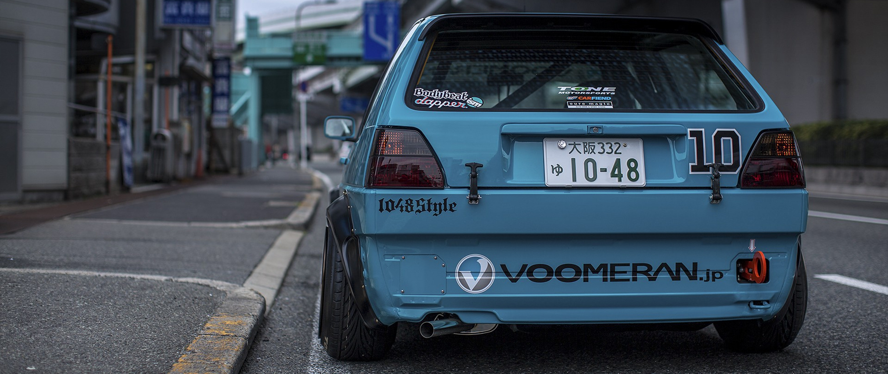

# Used Car Price Prediction - This is a prediction model deployed with Heroku

  

## Table of Contents
  * [App Link](#app-link)
  * [About the Project](#about-the-project)
  * [Dataset Preview](#dataset-preview)
  * [Deployement on Heroku](#deployement-on-heroku)
  * [Technologies Used](#technologies-used)

## App Link
If you want to view the deployed model, click on the following link:<br />
[https://flightfarepredictionismail.herokuapp.com/](https://flightfarepredictionismail.herokuapp.com/)


## About The Project 
After marrige you might want another car for your long drive. So, you start to wonder how much you're present car worth? Well data has the answer. From data of car's showroom price,selling price,fuel type,total driven kilometers,number of owner's car had,etc,.and help of machine learning algorhythms we can tell how much your car would make



 The columns in the given dataset are as follows: ```Car_Name:``` Name of Car sold ```Year:``` Year in which car was bought ```Selling_Price:``` Price at which car sold ```Present_Price:``` Price of same car model in current year ```Kms_Driven:``` Number of Kilometers Car driven before it is sold ```Fuel_Type:``` Type of fuel Car uses ```Seller_Type:``` Type of seller ```Transmission:``` Gear transmission of the car (Automatic / Manual) ```Owner:``` Number of previous owners 


## Dataset Prview
A preview of top five rows of the Car Dekho dataset. | | Car_Name | Year | Selling_Price | Present_Price | Kms_Driven | Fuel_Type | Seller_Type | Transmission | Owner | |-| -------- | ---- | ------------- | ------------- | ---------- | --------- | ----------- | ------------ | ----- | |0| ritz | 2014 | 3.35 | 5.59 | 27000 | Petrol | Dealer | Manual | 0 | |1| sx4 | 2013 | 4.75 | 9.54 | 43000 | Diesel | Dealer | Manual | 0 | |2| ciaz | 2017 | 7.25 | 9.85 | 6900 | Petrol | Dealer | Manual | 0 | |3| wagon r | 2011 | 2.85 | 4.15 | 5200 | Petrol | Dealer | Manual | 0 | |4| swift | 2014 | 4.60 | 6.87 | 42450 | Diesel | Dealer | Manual | 0 | 

## Deployement on Heroku
Login or signup in order to create virtual app. You can either connect your github profile or download ctl to manually to deploy this project.

[](https://heroku.com)

The next step would be to follow the instruction given in the [Heroku Documentation](https://devcenter.heroku.com/articles/getting-started-with-python) to deploy a web app.


## Technologies Used


[](https://flask.palletsprojects.com/en/1.1.x/) [](https://gunicorn.org) [](https://scikit-learn.org/stable/) 
